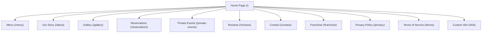

# MANDI MAFIA — USER EXPERIENCE & INFORMATION ARCHITECTURE BLUEPRINT
**Target Location:** Vijayawada, India  
**Strategic Focus:** Premium Arabian Fine Dining, Frictionless Conversions, and Brand Prestige  

---

## 1. INFORMATION ARCHITECTURE & SITEMAP

The sitemap is structured around a "Conversion-First, Cinema-Second" philosophy. The paths are kept flat to ensure clean navigation, fast crawling for search engines, and minimal friction.



### Page Purpose Definitions

| Page Route | Page Title | Strategic Business Purpose | Primary Call-To-Action (CTA) |
| :--- | :--- | :--- | :--- |
| `/` | Home | Hook visitors visually, introduce brand mystique, push reservations. | Secure a Table |
| `/about` | Our Story | Establish authenticity, culinary history, and VIP trust. | Meet the Chefs / View Menu |
| `/menu` | The Syndicate Roster | Display platters, Mandi styles, pricing, and dietary details. | Reserve a Platter |
| `/gallery` | Visual Intrigue | Showcase lighting, interior luxury, and physical styling. | Book Your Experience |
| `/reservations` | Claim Your Seat | Frictionless table, cabin, or large group reservation engine. | Submit Booking Request |
| `/private-events` | The Mafia Chambers | Sell high-margin family functions, birthdays, & corporate gatherings. | Inquire about Event |
| `/reviews` | Word on the Street | Build peer trust via blogger reviews and aggregated customer reviews. | Read Google Reviews |
| `/contact` | Locate the Syndicate | Display maps, address, direct phone lines, operating hours. | Get Directions / Call Now |
| `/franchise` | Expand the Alliance | Attract investors interested in expanding the brand across Andhra Pradesh. | Download Brochure |
| `/privacy` | Privacy Policy | Regulatory compliance, cookies details. | None |
| `/terms` | Terms of Service | Legal boundaries of bookings and cancellations. | None |
| `/404` | Custom 404 | Graceful error recovery. | Return to Main Chambers (Home) |

---

## 2. USER JOURNEY MAPS

To optimize for diverse audiences in Vijayawada, the navigation routes are mapped for four specific user personas.

### Journey 1: The Family Organizer (Primary Audience)
*   **Persona:** Father planning a 60th birthday celebration for a family of 12. Needs privacy, family cabins, high-capacity platters, and easy car parking.
*   **Friction Points:** Are the private cabins spacious enough? Is there valet parking? Can we order large platters in advance?
*   **Optimal Path:**
    ```text
    Homepage (Sees family platters)
    ↓
    Private Events Page (Verifies private cabin sizes & group booking limits)
    ↓
    Menu Page (Checks Platter choices & vegetarian options for elders)
    ↓
    Reservations Page (Fills form, enters 12 guests, selects "Private Family Cabin" and requests valet parking)
    ```

### Journey 2: The Young Professional Couple (Secondary Audience)
*   **Persona:** Couple looking for a premium, romantic weekend dining experience with high-end ambient lighting.
*   **Friction Points:** Is it too loud or crowded? Does the lighting feel premium? What is the pricing?
*   **Optimal Path:**
    ```text
    Homepage Hero Video (Sees premium low-light atmosphere)
    ↓
    Gallery Page (Views detailed couples' dining setups & lantern-lit tables)
    ↓
    Menu Page (Selects a shared gourmet Mandi platter)
    ↓
    Reservations Page (Secures a standard table for two at 8:00 PM)
    ```

### Journey 3: The Corporate Event Planner (Tertiary Audience)
*   **Persona:** Executive booking a team dinner for 25 people with custom menu options and official GST invoicing.
*   **Friction Points:** Can we get a corporate discount? Can they accommodate GST invoices? Is there Wi-Fi/A/V support if needed?
*   **Optimal Path:**
    ```text
    Homepage Footer (Taps Corporate / Private Events)
    ↓
    Private Events Page (Downloads "Corporate Feast Package" PDF)
    ↓
    Contact Page (Direct WhatsApp trigger to message the Reservation Manager)
    ```

### Journey 4: The Food Blogger & Influencer (Secondary Audience)
*   **Persona:** Local lifestyle influencer looking for cinematic presentation and high-quality photo spots.
*   **Friction Points:** What are the signature aesthetic dishes? Can they shoot during off-peak hours?
*   **Optimal Path:**
    ```text
    Homepage Gallery Preview (Reviews aesthetic quality)
    ↓
    Reviews Page (Checks write-ups, references past media shoots)
    ↓
    Contact Page (Submits inquiry form for "Media Partnerships")
    ```

---

## 3. HOMEPAGE CONTENT FLOW

The homepage uses a classic narrative arc designed to build desire, build trust, and then convert.

```text
+-------------------------------------------------------------+
| 1. HERO SECTION: Cinematic Hook                             |
|    - Emotional Goal: High-end luxury, excitement, hunger.   |
|    - CTA: "Secure a Table" (Primary) / "The Menu" (Secondary)|
+-------------------------------------------------------------+
                              ↓
+-------------------------------------------------------------+
| 2. BRAND STORY: The Syndicate Narrative                     |
|    - Emotional Goal: Intrigue, exclusivity, prestige.       |
|    - CTA: "Our Syndicate Heritage" (Text Link)             |
+-------------------------------------------------------------+
                              ↓
+-------------------------------------------------------------+
| 3. SIGNATURE SHOWCASE: High-Sensory Platters                |
|    - Emotional Goal: Appetite stimulation, premium standard.  |
|    - CTA: "View The Complete Roster" (Outline Button)       |
+-------------------------------------------------------------+
                              ↓
+-------------------------------------------------------------+
| 4. WHY CHOOSE US: The Culinary Mandi Secrets                |
|    - Emotional Goal: Trust, authenticity, local uniqueness. |
|    - CTA: None (Information absorption phase)               |
+-------------------------------------------------------------+
                              ↓
+-------------------------------------------------------------+
| 5. THE EXPERIENCE: Split Ambience Showcase                 |
|    - Emotional Goal: Sophistication, celebration comfort.   |
|    - CTA: "Explore Ambience Gallery" (Outline Button)       |
+-------------------------------------------------------------+
                              ↓
+-------------------------------------------------------------+
| 6. SOCIAL PROOF: Food Blogger & Google Reviews              |
|    - Emotional Goal: Peer validation, ultimate safety.      |
|    - CTA: "Read All Reviews" (Text Link)                    |
+-------------------------------------------------------------+
                              ↓
+-------------------------------------------------------------+
| 7. CONVERSION CARD: The Syndicate Registry                  |
|    - Emotional Goal: Exclusivity, urgency.                  |
|    - CTA: "Submit Reservation Request" (Solid Gold Button)  |
+-------------------------------------------------------------+
                              ↓
+-------------------------------------------------------------+
| 8. LOCAL ANCHOR: Vijayawada Skyline Map & Contact           |
|    - Emotional Goal: Convenience, physical reality.         |
|    - CTA: "Navigate to Mandi Mafia" / Call button           |
+-------------------------------------------------------------+
```

---

## 4. NAVIGATION STRATEGY

### Desktop Navigation System
*   **Visual Treatment:** Sticky, ultra-slim navbar with dynamic glassmorphic blurring (`backdrop-filter: blur(12px) background: rgba(13, 13, 13, 0.8)`). A 1px bottom border in Muted Gold (`rgba(212, 175, 55, 0.15)`).
*   **Layout Structure:**
    *   *Left aligned:* Links for `Menu`, `Our Story`, `Private Events`.
    *   *Centered:* High-definition Mandi Mafia logo.
    *   *Right aligned:* Links for `Gallery`, `Contact`, followed by a high-contrast primary CTA button: `Secure a Table`.
*   **Interaction Design:** Hovering over links prompts a smooth slide-in gold underline. The navbar header automatically shifts upward and hides when the user scrolls down, and slides down smoothly when scrolling up.

### Mobile Navigation System
*   **Visual Treatment:** Static status bar with Logo and a 2-line geometric hamburger icon in Antique Gold.
*   **Drawer Behavior:** Tapping the hamburger slides out a full-screen Obsidian backdrop. Links appear in large Cormorant Garamond font (`28px`), stacked vertically.
*   **Bottom Anchor:** The mobile drawer has a permanent direct Call link and a WhatsApp link pinned to the bottom.
*   **Sticky Conversion Element:** A permanent, sticky booking bar appears at the bottom of the mobile viewport (`height: 60px`) containing a single full-width button: `Book a Table`.

---

## 5. CONTENT BLUEPRINT FOR EVERY PAGE

### Page 1: Home Page (`/`)
*   **Headline (H1):** "A Syndicate of Flavor. An Alliance of Hospitality."
*   **Subheading:** "Experience Vijayawada’s premium Arabian Mandi fine dining, where slow-cooked culinary heritage meets modern luxury."
*   **Visuals:** 
    *   *Hero:* Background looped cinemagraph (15s duration, compressed, high definition) displaying ghee dripping onto slow-cooked mutton mandi.
    *   *Static backups:* High-contrast photography showing private lantern-lit tables.
*   **Key Trust Signals:** "Top Fine Dining Destination in Vijayawada" badge, Google Ratings counter (`4.8+ Stars from 2,000+ patrons`).

### Page 2: About / Our Story (`/about`)
*   **Headline (H2):** "The Alliance: Arabian Roots & Vijayawada Hearts"
*   **Description:** An editorial story detailing the imports of authentic spices directly from Yemen, combined with local slow-cooking wood-fire standards.
*   **Visuals:** Horizontal editorial panels showing spice sorting, wood-fire kitchens, and the design inspiration of Mandi Mafia's physical rooms.
*   **Statistics Column:**
    *   `18+` Hours Slow-Cooking Standard.
    *   `100%` Authentic Hand-Ground Spices.
    *   `12,000+` Happy Families Served.

### Page 3: The Menu (`/menu`)
*   **Headline (H2):** "The Syndicate Roster"
*   **Subheading:** "Every platter tells a secret. Select your feast below."
*   **User Interface Sections:**
    *   *Sticky Filter Tab:* Platters (Grand Feasts) | Signature Mandi | Starters & Skewers | Mocktails | Desserts.
    *   *Dietary Toggle:* All | Vegetarian | Non-Vegetarian.
*   **Dish Item Structure:**
    *   Cinematic image, detailed spice composition, portions guide (e.g., "Serves 3-4 Patrons"), Price in Gold, and a "Reserve Dish for Dinner" checkbox anchor.

### Page 4: Gallery (`/gallery`)
*   **Headline (H2):** "Visual Intrigue"
*   **Subheading:** "Take a tour through the chambers of Mandi Mafia."
*   **Visuals:** Masonry grid of photos and video reels categorized by: `The Platters`, `Family Chambers`, `Atmospheric Details`.
*   **Accessibility Note:** Every visual component includes exhaustive descriptive tags for screen readers (e.g., `alt="Glistening mutton mandi platter garnished with roasted cashews and saffron on deep charcoal plate"`).

### Page 5: Reservations (`/reservations`)
*   **Headline (H2):** "Claim Your Seat at the Table"
*   **Subheading:** "Ensure your spot in the syndicate registry. For immediate corporate bookings, call our concierge directly."
*   **Form Content Fields:**
    *   Full Name, Contact Number (with country code selector), Date of Dinner, Seating Preference (Standard Table | Private Family Cabin | VIP Lounge), Guest Count (`1` to `30+`), and Special Dining Requests.

### Page 6: Private Events (`/private-events`)
*   **Headline (H2):** "Host Your Syndicate"
*   **Subheading:** "From birthday celebrations to corporate gatherings, our chambers offer private spacing and custom menu designs."
*   **Visuals:** Video tour of the private dining rooms, highlighting soundproofing, large seating configurations, and dedicated servers.
*   **CTA:** Download Corporate Feast Catalogue (PDF link) / Inquire with Event Director (Direct WhatsApp link).

---

## 6. CALL-TO-ACTION (CTA) STRATEGY

To maximize conversions without feeling intrusive, CTAs are distributed into three priority tiers:

```text
+-------------------+-----------------------------------------+---------------------------------+
| CTA Tier          | Primary Visual Design                   | Trigger Placement Context       |
+-------------------+-----------------------------------------+---------------------------------+
| Tier 1: Primary   | Solid Antique Gold, Obsidian Text.       | Hero Area, Mobile Sticky Bar,  |
|                   | Subtle radial glow on hover.            | Navbar Header (Desktop).        |
+-------------------+-----------------------------------------+---------------------------------+
| Tier 2: Secondary | Transparent Fill, Thin Gold Outline,     | Menu Item Cards, Gallery        |
|                   | Warm Ivory Text.                        | Previews, Event Package Cards.  |
+-------------------+-----------------------------------------+---------------------------------+
| Tier 3: Utility   | Plain text with trailing dot (•) or     | Footer lists, detailed FAQ      |
|                   | inline layout (e.g., WhatsApp icon).    | blocks, reviews scroll anchor.  |
+-------------------+-----------------------------------------+---------------------------------+
```

### Contextual CTA Trigger Mapping
*   **Homepage Hero:** Primary CTA: `Secure a Table` | Secondary CTA: `Explore the Roster`.
*   **Food Card Details:** Secondary CTA: `Reserve Dish with Table` (Direct link mapping to `/reservations` prefilled with selected dish parameters).
*   **Contact Card:** Primary CTA: `Get Directions` (Deep link opening Google Maps natively) | Secondary CTA: `Call Concierge` (Native dialer).

---

## 7. SEO PAGE STRUCTURE & HIERARCHY

A clean, semantic SEO hierarchy ensures Mandi Mafia ranks at the top for local dining searches in Andhra Pradesh.

### URL Taxonomy
*   `https://mandimafia.com/` (Targeting: *Premium Restaurant Vijayawada*, *Mandi Mafia*)
*   `https://mandimafia.com/menu` (Targeting: *Best Mandi in Vijayawada*, *Arabian Platters Menu*)
*   `https://mandimafia.com/reservations` (Targeting: *Book Table Mandi Mafia*, *Vijayawada Restaurant Reservations*)
*   `https://mandimafia.com/private-events` (Targeting: *Party Halls Vijayawada*, *Family Cabin Dining*)

### Internal Linking Blueprint
*   All footer blocks link back directly to `/menu` and `/reservations`.
*   The About page includes context links pointing to the Signature Platters segment on the Menu page.
*   The Reviews page includes inline calls to action linking back to the table booking page.

### JSON-LD Structured Data Schema (Target: Home Page `/`)
```json
{
  "@context": "https://schema.org",
  "@type": "Restaurant",
  "name": "Mandi Mafia",
  "image": "https://mandimafia.com/assets/images/cinematic/hero-platter.jpg",
  "url": "https://mandimafia.com",
  "telephone": "+91-XXXXXXXXXX",
  "priceRange": "$$$",
  "menu": "https://mandimafia.com/menu",
  "servesCuisine": ["Arabian", "Mandi", "Middle Eastern", "Fine Dining"],
  "acceptsReservations": "true",
  "address": {
    "@type": "PostalAddress",
    "streetAddress": "Mandi Mafia Street, Beside Skyline Hub",
    "addressLocality": "Vijayawada",
    "addressRegion": "AP",
    "postalCode": "520001",
    "addressCountry": "IN"
  },
  "geo": {
    "@type": "GeoCoordinates",
    "latitude": "16.5062",
    "longitude": "80.6480"
  },
  "openingHoursSpecification": [
    {
      "@type": "OpeningHoursSpecification",
      "dayOfWeek": ["Monday", "Tuesday", "Wednesday", "Thursday", "Friday", "Saturday", "Sunday"],
      "opens": "11:30",
      "closes": "23:00"
    }
  ]
}
```

---

## 8. RESPONSIVE UX ADAPTATION

```text
+-----------------------+-----------------------+-----------------------+
| DESKTOP (1200px+)     | TABLET (768px - 1023px)| MOBILE (< 767px)      |
|                       |                       |                       |
| • Full Horizontal Nav | • Hamburger Menu Icon | • Hamburger Menu Icon |
| • Multi-Column Grids  | • Two-Column Grids    | • Single-Column Stack |
| • Ambient Hover Glows | • Swipeable Trays     | • Sticky Bottom CTA   |
| • Embedded Maps View  | • Tap Interactivity  | • Native App Prompts  |
+-----------------------+-----------------------+-----------------------+
```

### Tablet Transition Details
*   The multi-column grid menus collapse to double columns.
*   Horizontal hovering elements (such as expanding gallery cards) transition to a simple scroll-snap layout.

### Mobile Optimization Details
*   A persistent, sticky action bar containing `Book a Table` and `Call Now` buttons is pinned to the bottom.
*   Tap targets are sized to a minimum of `48px x 48px` to ensure comfortable usability on all handheld devices.
*   Heavy video loops are paused on slower mobile networks using network-aware JS scripts.

---

## 9. CONVERSION OPTIMIZATION RECOMMENDATIONS

1.  **Reduce Reservation Form Friction:** Eliminate password creation or email verification steps. Utilize a fast phone verification flow (such as OTP or WhatsApp auto-fill) to guarantee immediate validation.
2.  **Highlight "Platter Capacity":** Clearly state the serving sizes of dishes on the menu page (e.g., "Perfect for 4 People"). This encourages larger groups to book, increasing the average order value.
3.  **Real-Time Booking Indicators:** Integrate subtle booking notifications (e.g., "Only 3 private family cabins left for tonight") to build a sense of luxury and urgency.
4.  **Incentivize Direct Bookings:** Offer a complimentary signature mocktail or priority VIP seating selections to guests who book directly through the website rather than calling third-party aggregators.
5.  **Offline Backup Integration:** If the digital booking database undergoes maintenance, the system must automatically fall back to standard WhatsApp messages or direct dial prompts.
